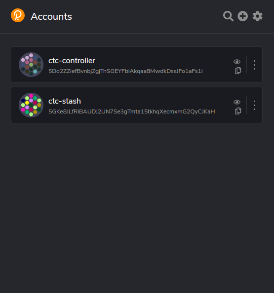
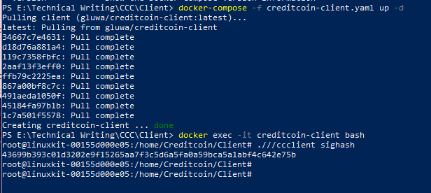

# Creditcoin Miner's Manual

## Prerequisites

Before connecting to the Creditcoin blockchain, you will need to set up the following:

* An Ethereum private key
* An Ethereum RPC mainnet node
* A 256 bit SECP256K1 ECDSA private key
* Docker Desktop

### Get an Ethereum private key

This section is for new Ethereum users who need to create a wallet. We recommend creating a wallet using [MetaMask](https://metamask.io). Refer to [_How to Export an Account Private Key_](https://metamask.zendesk.com/hc/en-us/articles/360015289632-How-to-Export-an-Account-Private-Key) on the [Metamask Support](https://metamask.zendesk.com/hc/en-us) site for more information on how to obtain your private key.

### Set up an Ethereum RPC mainnet node

This section will cover how to set up an Ethereum RPC mainnet node using [infura.io](https://infura.io) _Alternatively, you can set up your own private RPC mainnet node._

1. Go onto [infura.io](https://infura.io/register), create a new account and confirm your email address.
2. In your Infura account dashboard page, click on 'Create New Project' and name it accordingly.
3. Click on 'View Project' and you will have access to your mainnet node (aka Endpoint).

.png>)

### Get a 256 bit SECP256K1 ECDSA key

You have two options here, depending on whether you'd like to share the same wallet between your miner and client, or have separate ones.

1\. Share your wallet between your miner and the client.

* See the steps under the [_Get your miner key_](./#get-your-miner-key) section of the document for information on how this is done.

2\. You can use this [ECDSA sample generator](https://kjur.github.io/jsrsasign/sample/sample-ecdsa.html):

* Click on 'generate EC pair'
* Use the generated 'EC private key'



### Configure Docker Desktop

Running a container launches your software with private resources, securely isolated from the rest of your machine.

1. [Create a Docker account](https://hub.docker.com/signup) and confirm your email address.
2. Download [Docker Desktop](https://hub.docker.com/?overlay=onboarding) and install it.
3. Once Docker is installed, log in using your newly created account.
4. Click on the Docker icon in your taskbar and select 'Settings'
5. Under the 'Shared Drives' tab, make sure you have the drive where the Creditcoin containers will be running


## Creditcoin Miner

To configure the Creditcoin Miner files, you will need the following:

* An Ethereum private key
* Your Ethereum RPC mainnet node
* A 256 bit SECP256K1 ECDSA key
* [Your static public IP address](https://www.whatismyip.com)

Firstly, [download the Creditcoin files](https://github.com/gluwa/CreditcoinDockerCompose-Mainnet). Afterwards, extract the files in a directory of your choice. You will need to configure the following:

* `Server/gatewayConfig.json`
* `Server/docker-compose.yaml`

You can edit those files by opening them with your preferred text editor.

#### Server/gatewayConfig.json

```javascript
{
  "bindIP": "0.0.0.0",
  "bitcoin": {
    "rpc": "<bitcoin_rpc_node_url>",
    "credential": "<rpc_username:rpc_password>"
  },
  "ethereum": {
    "creditcoinContract": "0xa3ee21c306a700e682abcdfe9baa6a08f3820419",
    "creditcoinContractAbi": "[{'constant':false,'inputs':[{'name':'tokenHolders','type':'address[]'},{'name':'amounts','type':'uint256[]'}],'name':'recordSales730Days','outputs':[],'payable':false,'stateMutability':'nonpayable','type':'function'},{'constant':true,'inputs':[],'name':'VestingStartDate','outputs':[{'name':'','type':'uint256'}],'payable':false,'stateMutability':'view','type':'function'},{'constant':true,'inputs':[],'name':'name','outputs':[{'name':'','type':'string'}],'payable':false,'stateMutability':'view','type':'function'},{'constant':false,'inputs':[{'name':'spender','type':'address'},{'name':'value','type':'uint256'}],'name':'approve','outputs':[{'name':'success','type':'bool'}],'payable':false,'stateMutability':'nonpayable','type':'function'},{'constant':true,'inputs':[{'name':'tokenHolder','type':'address'}],'name':'vestedBalanceOf','outputs':[{'name':'balance','type':'uint256'}],'payable':false,'stateMutability':'view','type':'function'},{'constant':true,'inputs':[],'name':'totalSupply','outputs':[{'name':'amount','type':'uint256'}],'payable':false,'stateMutability':'view','type':'function'},{'constant':true,'inputs':[{'name':'tokenHolder','type':'address'}],'name':'purchasedBalanceOf365Days','outputs':[{'name':'balance','type':'uint256'}],'payable':false,'stateMutability':'view','type':'function'},{'constant':false,'inputs':[{'name':'value','type':'uint256'},{'name':'sighash','type':'string'}],'name':'exchange','outputs':[{'name':'success','type':'bool'}],'payable':false,'stateMutability':'nonpayable','type':'function'},{'constant':false,'inputs':[{'name':'from','type':'address'},{'name':'to','type':'address'},{'name':'value','type':'uint256'}],'name':'transferFrom','outputs':[{'name':'success','type':'bool'}],'payable':false,'stateMutability':'nonpayable','type':'function'},{'constant':true,'inputs':[{'name':'tokenHolder','type':'address'}],'name':'vestedBalanceOf183Days','outputs':[{'name':'balance','type':'uint256'}],'payable':false,'stateMutability':'view','type':'function'},{'constant':true,'inputs':[],'name':'decimals','outputs':[{'name':'','type':'uint8'}],'payable':false,'stateMutability':'view','type':'function'},{'constant':false,'inputs':[{'name':'tokenHolders','type':'address[]'},{'name':'amounts','type':'uint256[]'}],'name':'recordSales1095Days','outputs':[],'payable':false,'stateMutability':'nonpayable','type':'function'},{'constant':true,'inputs':[{'name':'tokenHolder','type':'address'}],'name':'vestedBalanceOf365Days','outputs':[{'name':'balance','type':'uint256'}],'payable':false,'stateMutability':'view','type':'function'},{'constant':false,'inputs':[{'name':'value','type':'uint256'}],'name':'burn','outputs':[{'name':'success','type':'bool'}],'payable':false,'stateMutability':'nonpayable','type':'function'},{'constant':true,'inputs':[{'name':'tokenHolder','type':'address'}],'name':'purchasedBalanceOf2190Days','outputs':[{'name':'balance','type':'uint256'}],'payable':false,'stateMutability':'view','type':'function'},{'constant':false,'inputs':[{'name':'tokenHolders','type':'address[]'},{'name':'amounts','type':'uint256[]'}],'name':'recordSales183Days','outputs':[],'payable':false,'stateMutability':'nonpayable','type':'function'},{'constant':false,'inputs':[{'name':'tokenHolder','type':'address'},{'name':'numCoins','type':'uint256'}],'name':'recordSale365Days','outputs':[],'payable':false,'stateMutability':'nonpayable','type':'function'},{'constant':true,'inputs':[{'name':'tokenHolder','type':'address'}],'name':'vestedBalanceOf730Days','outputs':[{'name':'balance','type':'uint256'}],'payable':false,'stateMutability':'view','type':'function'},{'constant':true,'inputs':[{'name':'tokenHolder','type':'address'}],'name':'purchasedBalanceOf','outputs':[{'name':'balance','type':'uint256'}],'payable':false,'stateMutability':'view','type':'function'},{'constant':true,'inputs':[{'name':'owner','type':'address'}],'name':'balanceOf','outputs':[{'name':'balance','type':'uint256'}],'payable':false,'stateMutability':'view','type':'function'},{'constant':false,'inputs':[],'name':'finalizeSales','outputs':[],'payable':false,'stateMutability':'nonpayable','type':'function'},{'constant':false,'inputs':[{'name':'from','type':'address'},{'name':'value','type':'uint256'}],'name':'burnFrom','outputs':[{'name':'success','type':'bool'}],'payable':false,'stateMutability':'nonpayable','type':'function'},{'constant':true,'inputs':[{'name':'tokenHolder','type':'address'}],'name':'vestedBalanceOf2190Days','outputs':[{'name':'balance','type':'uint256'}],'payable':false,'stateMutability':'view','type':'function'},{'constant':true,'inputs':[{'name':'tokenHolder','type':'address'}],'name':'purchasedBalanceOf730Days','outputs':[{'name':'balance','type':'uint256'}],'payable':false,'stateMutability':'view','type':'function'},{'constant':true,'inputs':[],'name':'symbol','outputs':[{'name':'','type':'string'}],'payable':false,'stateMutability':'view','type':'function'},{'constant':false,'inputs':[{'name':'tokenHolder','type':'address'},{'name':'numCoins','type':'uint256'}],'name':'recordSale183Days','outputs':[],'payable':false,'stateMutability':'nonpayable','type':'function'},{'constant':false,'inputs':[{'name':'to','type':'address'},{'name':'value','type':'uint256'}],'name':'transfer','outputs':[{'name':'success','type':'bool'}],'payable':false,'stateMutability':'nonpayable','type':'function'},{'constant':true,'inputs':[],'name':'creditcoinSalesLimit','outputs':[{'name':'','type':'uint256'}],'payable':false,'stateMutability':'view','type':'function'},{'constant':true,'inputs':[{'name':'tokenHolder','type':'address'}],'name':'vestedBalanceOf1095Days','outputs':[{'name':'balance','type':'uint256'}],'payable':false,'stateMutability':'view','type':'function'},{'constant':true,'inputs':[],'name':'creditcoinLimitInFrac','outputs':[{'name':'','type':'uint256'}],'payable':false,'stateMutability':'view','type':'function'},{'constant':false,'inputs':[{'name':'tokenHolder','type':'address'},{'name':'numCoins','type':'uint256'}],'name':'recordSale2190Days','outputs':[],'payable':false,'stateMutability':'nonpayable','type':'function'},{'constant':false,'inputs':[{'name':'tokenHolder','type':'address'},{'name':'numCoins','type':'uint256'}],'name':'recordSale730Days','outputs':[],'payable':false,'stateMutability':'nonpayable','type':'function'},{'constant':true,'inputs':[{'name':'tokenHolder','type':'address'}],'name':'purchasedBalanceOf1095Days','outputs':[{'name':'balance','type':'uint256'}],'payable':false,'stateMutability':'view','type':'function'},{'constant':true,'inputs':[{'name':'owner','type':'address'},{'name':'spender','type':'address'}],'name':'allowance','outputs':[{'name':'remaining','type':'uint256'}],'payable':false,'stateMutability':'view','type':'function'},{'constant':false,'inputs':[],'name':'startVesting','outputs':[],'payable':false,'stateMutability':'nonpayable','type':'function'},{'constant':false,'inputs':[{'name':'tokenHolders','type':'address[]'},{'name':'amounts','type':'uint256[]'}],'name':'recordSales2190Days','outputs':[],'payable':false,'stateMutability':'nonpayable','type':'function'},{'constant':true,'inputs':[{'name':'tokenHolder','type':'address'}],'name':'purchasedBalanceOf183Days','outputs':[{'name':'balance','type':'uint256'}],'payable':false,'stateMutability':'view','type':'function'},{'constant':true,'inputs':[],'name':'IsSalesFinalized','outputs':[{'name':'','type':'bool'}],'payable':false,'stateMutability':'view','type':'function'},{'constant':false,'inputs':[{'name':'tokenHolders','type':'address[]'},{'name':'amounts','type':'uint256[]'}],'name':'recordSales365Days','outputs':[],'payable':false,'stateMutability':'nonpayable','type':'function'},{'constant':false,'inputs':[{'name':'tokenHolder','type':'address'},{'name':'numCoins','type':'uint256'}],'name':'recordSale1095Days','outputs':[],'payable':false,'stateMutability':'nonpayable','type':'function'},{'inputs':[{'name':'creditcoinFoundation','type':'address'},{'name':'devCost','type':'address'}],'payable':false,'stateMutability':'nonpayable','type':'constructor'},{'payable':true,'stateMutability':'payable','type':'fallback'},{'anonymous':false,'inputs':[{'indexed':true,'name':'from','type':'address'},{'indexed':false,'name':'value','type':'uint256'},{'indexed':true,'name':'sighash','type':'string'}],'name':'Exchange','type':'event'},{'anonymous':false,'inputs':[{'indexed':true,'name':'from','type':'address'},{'indexed':false,'name':'value','type':'uint256'}],'name':'Burnt','type':'event'},{'anonymous':false,'inputs':[{'indexed':true,'name':'from','type':'address'},{'indexed':true,'name':'to','type':'address'},{'indexed':false,'name':'value','type':'uint256'}],'name':'Transfer','type':'event'},{'anonymous':false,'inputs':[{'indexed':true,'name':'owner','type':'address'},{'indexed':true,'name':'spender','type':'address'},{'indexed':false,'name':'value','type':'uint256'}],'name':'Approval','type':'event'}]",
    "rpc": "<ethereum_node_url>"
  },
  "ethless" : {
    "rpc": "<ethereum_node_url>"
  },
  "erc20": {
    "rpc": "<ethereum_node_url>"
  }
}
```

You need to edit the following elements in each section:

* rpc: **RPC mainnet node (e.g. `https://mainnet.infura.io/v3/xxxxxxxxxxxx`) or your own personal mainnet node (e.g. `http://localhost:8545` )**

#### Server/docker-compose.yaml

```yaml
--endpoint tcp://<insert.your.ip>:8800 \
```

1. Replace `<insert.your.ip>` on lines 51 and 61 with [your public IPv4 address.](https://www.whatismyip.com) The public IPv4 address must be static and not generated from DHCP.  Do not include the `"<" and ">"` signs. For example:\
   `--endpoint tcp://13.93.178.197:8800 \`
2. To allow others to access your node, the port used in the above line (e.g. 8800) should be [opened in your firewall and forwarded in your router](https://www.wikihow.com/Open-Ports).

### Connecting to the Creditcoin Blockchain

Now that you've got Docker Desktop installed and you've updated your Creditcoin configuration files, you're ready to start the Miner's Docker containers and get connected to the Creditcoin Blockchain!

#### Opening Command Prompt on Windows

1. Open a PowerShell by right-clicking the icon and pressing 'Run as administrator'.
2. Change the directory to the folder containing the Creditcoin documentation.

```
Set-location "C:/My Folder"
```

#### Opening Command Prompt on Mac OS X

1. Open Terminal by pressing `cmd + spacebar` and searching for 'Terminal'.
2. Change the directory to the folder containing the Creditcoin documentation.

```
cd ~/Documents
```

### Start the Creditcoin Miner

Run the command:

`docker-compose -f Server/docker-compose.yaml up`


Upon running the above command, the blockchain will start downloading and messages such as the following will be displayed:

```
sawtooth-validator | [2020-01-01 11:22:33.444 DEBUG    permission_verifier] Chain head is not set yet. Permit all.
sawtooth-validator | [2020-01-01 11:22:33.444 DEBUG    completer] Request missing predecessor
```

### Get your miner sighash and balance

You will first need to get your **miner key** and edit the `clientConfig.json` file in order to retrieve your miner balance and sighash.

#### **Get your miner key**

1. Run the Server
2. While the shell window is populated with messages, open a new instance of the command prompt/terminal &#x20;
3.  In the new command prompt window, get the validator private key by running the following command:

    `docker exec sawtooth-validator-default cat /etc/sawtooth/keys/validator.priv`
4. Copy the outputted key of the above
5. Open the Client/clientConfig.json file
6. Paste the copied key into the `signer` value&#x20;
7. Set the `creditcoinRestApiURL` as follows:

```
creditcoinRestApiURL: ''
```

#### **Retrieve your miner sighash and balance**

1.  Start the Creditcoin client:

    `docker-compose -f Client/docker-compose.yaml up -d`
2. Access the Creditcoin Client bash by running the following command: `docker exec -it creditcoin-client bash`
3. Get your sighash by running the following command: `./ccclient sighash`
4. Check your balance by running the following command: `./ccclient show Balance 0`

#### Check your balance on the Creditcoin Explorer website

You can check your miner balance by following the link below and replacing the {insert\_sighash} with your miner sighash. This is useful for checking your balance without having to run any Docker containers or start the Creditcoin client.

__[** https://www.creditcoinexplorer.com/address-detail?address={sighash\_here**](https://www.creditcoinexplorer.com/address-detail?address=%3Csighash\_here%3E)**}**

_If upon running the command to check your balance you are getting `error 404`, then the address has not mined any blocks yet and there are no records in the blockchain API relating to that address._

### Stop the Creditcoin Miner

Run the command:

`docker-compose -f Server/docker-compose.yaml down`

### Block successfully mined

Upon successfully mining a block, the following message will be displayed:

```
sawtooth-validator | [2020-01-01 12:34:56.789 INFO     publisher] Claimed Block: [block id] (block_num:[block number], state:[state id], previous_block_id:[previous block id])
```

## Creditcoin Client

### Creditcoin Client Configuration File

To set-up the Creditcoin Client configuration, you will need the following:

* An Ethereum private key
* Your Ethereum RPC mainnet node
* A 256 bit SECP256K1 ECDSA key

1. Firstly, [download the Creditcoin files](https://github.com/gluwa/CreditcoinDocs-Mainnet) (If you did this step for the Creditcoin Miner, you already have these files).
2. Afterwards, extract the files in a directory of your choice. You will need to configure the following:\
   `Client/clientConfig.json`

You can edit this file by opening it with your preferred text editor

```javascript
{
  "signer": "<256_bit_key_secp256k1_ECDSA>",
  "creditcoinRestApiURL": "",
  "ethereum": {
    "creditcoinContract": "0xa3ee21c306a700e682abcdfe9baa6a08f3820419",
    "creditcoinContractAbi": "<creditcoinContractAbi",
    "rpc": "<ethereum_node_url>",
    "secret": "<ethereum_private_key_no_0x>",
    "gasPriceInGwei":  "<set_to_override_gas_price>"
  },
  "ethless" : {
    "rpc": "<ethereum_node_url>"
  },
  "erc20": {
    "rpc": "<ethereum_node_url>"
  },
  "bitcoin": {
    "secret": "<bitcoin_private_key>",
    "rpc": "<bitcoin_rpc_node_url>",
    "credential": "<rpc_username:rpc_password>",
    "fee": "10000"
  },
}
```

You will need to edit the following elements:

* signer: **Your 256 bit SECP256K1 ECDSA key**
* ethereum/ethless/erc20:
*
  * rpc:  **RPC mainnet node (e.g. `https://mainnet.infura.io/v3/xxxxxxxxxxxx`) or your own personal mainnet node (e.g. `http://localhost:8545` )**
  * secret: **Your Ethereum private key without the `0x` prefix**

You can use the Bitcoin section to loan/fundraise Bitcoin. Otherwise, you can leave it blank.

### Start the Creditcoin Client

1.  Start the client docker container:

    `docker-compose -f Client/docker-compose.yaml up -d`
2. Get your Client sighash:\
   `docker exec -it creditcoin-client bash`

### **Get your Client sighash**

Get your client sighash by typing `./ccclient sighash` into the Creditcoin Client bash &#x20;



### Stop the Creditcoin Client

Run the command:

`docker-compose -f Client/docker-compose.yaml down`

## Troubleshooting

#### Recovering from an incorrectly formatted command

From time-to-time, the Creditcoin client may get ‘stuck’ on an improperly formatted command line. To recover from this run the command `rm plugins/progress.txt`, then retype the command correctly.

The purpose of progress.txt is to rerun an interrupted command. For example, while waiting for sufficient confirmation on the Ethereum network, a user can stop the Creditcoin Client, then later run the Creditcoin Client command (./ccclient) again without parameters. Here we're removing the invalid command to prevent it from automatically rerunning.
